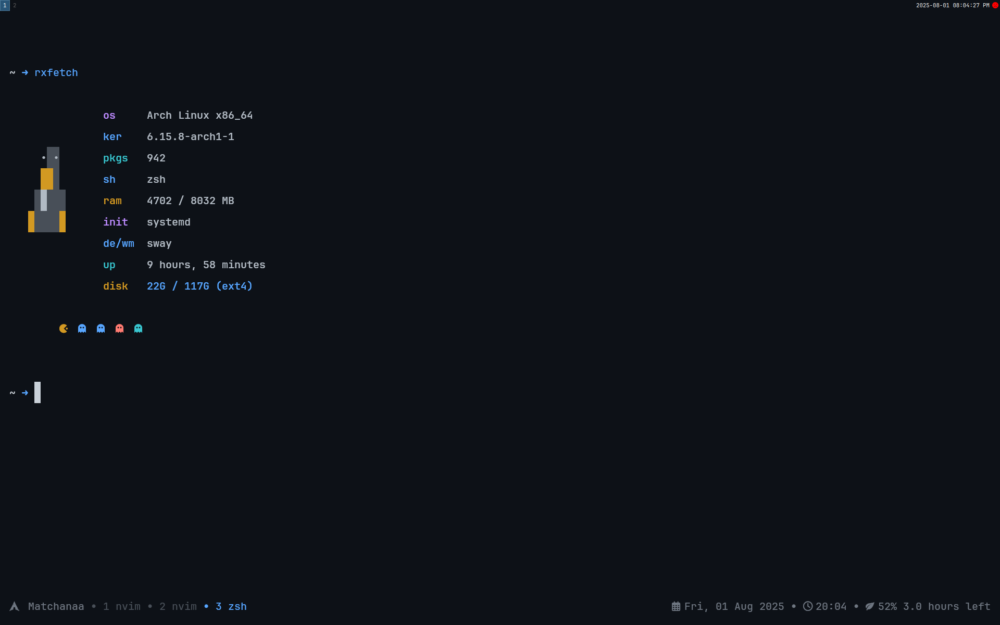

### My Cool Dotfiles

#### Preview



Repositori ini berisi konfigurasi pribadi ana untuk sistem Linux, dirancang untuk meningkatkan produktivitas dan estetika. Semua konfigurasi dikelola menggunakan GNU Stow agar mudah di-deploy ke sistem baru.

#### Specification

- 🖥️ OS: _Endeavour OS_
- 🪟 WM: _i3WM_
- 📟 Terminal: _Kitty_
- 📊 Status Bar: _Polybar_
- 🌀 Compositor: _Picom_
- 🚀 Launcher: _Rofi_
- 📁 File Manager: _Yazi Terminal File Manager_
- 🖋️ Code Editor: _NvChad Distro_
- ✍️  Font: _JetBrainsMono Nerd Font_
- 🔔 Notifications: _Dunst_
- 🧭 Browser: _Brave_
- 🐚 Shell: _Zsh_

#### Dependencies

Pastikan aplikasi berikut sudah terinstal di sistem Antum:

- `GNU Stow` untuk manajemen dotfiles.
- `i3WM`, `Polybar`, `Kitty`, `Picom`, `Neofetch`, `Neovim`, `Dunst`, `tmux`,dan `Rofi` untuk konfigurasi utama.

#### Instalation

1. Clone repositori:

   ```bash
   git clone https://github.com/MatchaTi/dotfiles.git
   ```

2. Masuk ke direktori dotfiles:

   ```bash
   cd dotfiles
   ```

3. Deploy dotfiles menggunakan GNU Stow:
   ```bash
   stow i3 polybar kitty picom nvim rofi neofetch dunst tmux
   ```

4. Or
   ```bash
   stow .
   ```

Selamat menggunakan dan bereksperimen dengan konfigurasi ini! 😊
